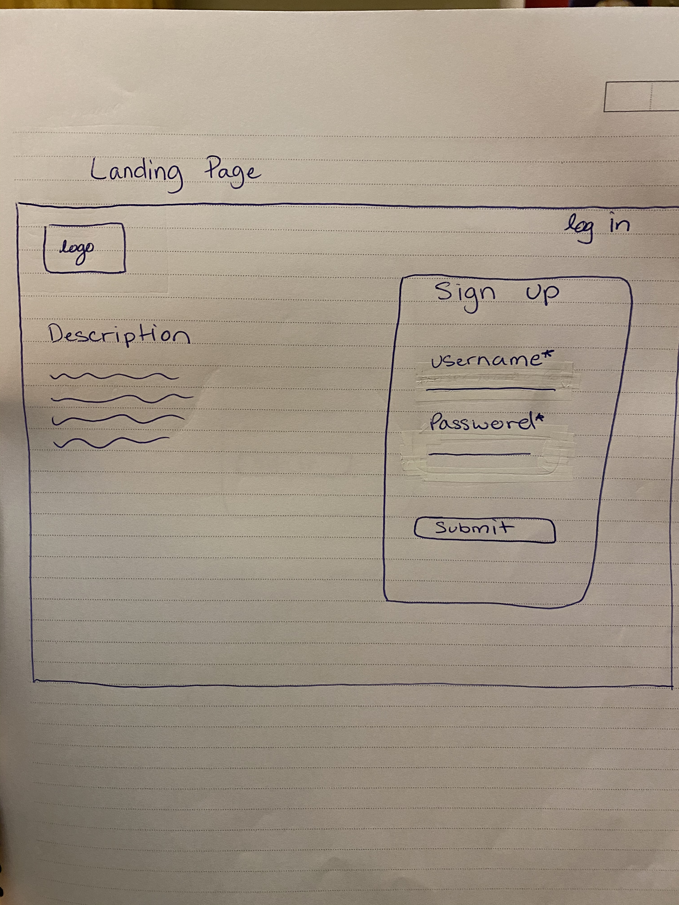

# book-search-capstone-client

## Working Prototype
Coming soon

## User Stories
This app has two types of users: Visitors and logged-in users

### Landing Page
* As a visitor 
* I want to understand the app is
* So that I decide to sign up or not

### Sign Up
* As a visitor
* I want to register to use this app
* So that I could store collection of books

### Start Creating Book Collection
* As a user 
* I want undestand how to create a collection
* So that I could begin to add books

### Dashboard 
* As a user 
* I want to understand how to navigate the dashoard
* So that I could understand how to use the app

### Add Book To Collection
* As a user 
* I want to know how to add books to my collection
* So that I can create a list of books I own, or have read

### Adding Comments and Rating Books
* As a user
* I want to be able to click on a book in my collection
* So that I could add comments and rate the book 

### Search For Books
* As a user 
* I want to be able to search for books to add to my collection
* So that I could add books to my collection

## Wireframes
Landing/Login Page |
:-------------------------:|:-------------------------:
  |  

## Business Objects (database structure)
### User
  * User Id
  * Username (Email Address)
  * Password (8 char, at least 1 Alpha, 1 Num, 1 Cap )

### Book Collection
  * Collection ID
  * User Id
  * Collection Name(Genre, Location)(String Varchar 255  )

### Book
  * Book ID
  * Collection ID
  * Finished (Boolean)
  * Title (String Varchar 255)
  * Author (String Varchar 255)
  * Genre (String Varchar 255)
  * ISBN ID (String Varchar 255)
  * Year Published (Integer)
  * Description (Text)
  * Bookamrk Page (Integer)

### Comments
  * Comments ID
  * Book ID 
  * Book Comment (Text)
  * Book Rating (Integer 1-5)